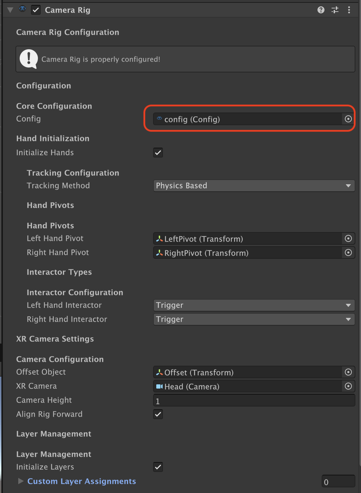

# Getting Started with Shababeek Interactions — Quick Start Guide

Welcome to the Shababeek Interaction System! This guide will get you from zero to grabbing your first VR object in about 10 minutes, then show you how to create more advanced interactions.

---

## What You'll Learn

By the end of this guide, you'll have:
- ✅ A VR scene set up with hands
- ✅ An object you can pick up and throw
- ✅ Sound effects when grabbing
- ✅ A custom hand pose for your object
- ✅ A lever and a button
- ✅ Understanding of the core concepts

**Time Required:** ~15 minutes
**Prerequisites:** Unity 2021.3 or newer, VR headset (Quest, PCVR, etc.)

---

## Part 1: Basic Setup (10 minutes)

### Step 1: Install the Package (2 minutes)

#### Option A: Unity Package Manager (Recommended)
1. Open your Unity project
2. **Window > Package Manager**
3. Click **+** > **Add package from git URL**
4. Enter: `https://github.com/YourRepo/Shababeek-Interactions.git`
5. Click **Add**


#### Option B: Download and Import
1. Download the `.unitypackage` from [releases page](https://github.com/Shababeek/Interactions/releases)
2. **Assets > Import Package > Custom Package**
3. Select the downloaded file
4. Click **Import**

#### Verify Installation
Check that you see `Shababeek` folder in your Project window:
```
Assets/
└── Shababeek/
    ├── Interactions/
    ├── Core/
    └── Utilities/
```

---

### Step 2: Create the Config Asset (1 minute)

The Config asset is the brain of the interaction system. You only create this once per project.

#### Use the Wizard (Recommended)
1. Context menu: **Shababeek > Setup Wizard**
2. Follow the steps on screen

#### Create Manually
1. **Right click** → Shababeek → Interaction System Config


#### Basic Setup
The Config comes with good defaults, but verify these settings:

**Essential Settings (in Inspector):**
- **Interaction Layers:** Set to dedicated layers (create them if needed)
- **Hand Data:** Assign the default HandData asset from the list


> 💡 **Tip:** Use default settings from the setup wizard and then edit as needed.

✅ **Checkpoint:** Config asset created and set up!

---

### Step 3: Set Up Your VR Scene (3 minutes)

#### Add XR Origin
If you don't already have a VR setup:

1. `GameObject > Shababeek > Initialize Scene` or right-click in hierarchy → `Shababeek > Initialize Scene`
   - This deletes the main camera
   - Creates Camera Rig object with required components

#### Configure CameraRig
1. If the config file is not added automatically, drag it to the Camera Rig



✅ **Checkpoint:** VR hands are set up and ready to interact! (Press Play and see it in action)

---

### Step 4: Make Your First Grabbable Object (2 minutes)

Time to create something you can pick up!

#### Create a Simple Cube
1. **GameObject > 3D Object > Cube**
2. Name it "Grabbable Cube"
3. Scale it down to (0.2, 0.2, 0.2) — a 1m cube is too big to hold!
4. Position it in front of the player

#### Make It Grabbable
1. Right-click on your Cube: `Shababeek > Make Into > Grabable`
2. That's it! This automatically adds:
   - A **PoseConstrainer** component (for hand positioning)
   - A **Grabable** component


#### Set the Layer (Optional but Recommended)
1. At the top of Inspector, click **Layer** dropdown
2. Select **Interactable** (or whatever you set in Config)

✅ **Checkpoint:** You have a grabbable cube!

---

### Step 5: Test It! (1 minute)

#### Press Play
1. Put on your VR headset
2. Click the **Play** button in Unity
3. Reach out toward the cube
4. Press the **Grip** button (side button on your controller)
5. The cube attaches to your hand!
6. Move your hand around — the cube follows
7. Release Grip — the cube drops

#### Troubleshooting Quick Fixes

**Can't see hands?**
- Check Hand component has HandData assigned
- Verify hand prefabs exist in HandData asset

**Can't grab cube?**
- Make sure the selected Input method is enabled in Player Settings
- Change the Input method in Config file
- Make sure cube has a Collider

✅ **Checkpoint:** You successfully grabbed an object in VR!

---

### Step 6: Add Grab Sound (2 minutes)

Make it feel more real with audio feedback!

#### Add Audio Source
1. Select your Grabbable Cube
2. **Add Component > Audio Source**
3. **Uncheck** "Play On Awake"
4. Drag your sound file into **AudioClip** field

#### Wire Up the Event
1. On the **Grabable** component, find the **Events** section
2. Expand **On Selected**
3. Click the **+** button
4. Drag your **Grabbable Cube** into the **Object** field
5. Click the function dropdown: **AudioSource > Play()**

#### Test It Again!
Press Play, put on headset, grab the cube — you should hear your sound!

✅ **Checkpoint:** Your object now has audio feedback!

---

## Part 2: Hand Poses with PoseConstrainer (5 minutes)

The **PoseConstrainer** component controls how the hand looks and positions when grabbing an object. Let's customize it!

### Understanding PoseConstrainer

When you created your grabbable cube, a PoseConstrainer was automatically added. This component controls:

- **Hand Position** — Where the hand appears relative to the object
- **Hand Rotation** — How the hand is oriented
- **Finger Poses** — Individual finger curl amounts
- **Constraint Type** — How the hand behaves during interaction

### Step 7: Configure a Custom Hand Pose

#### Open PoseConstrainer Settings
1. Select your Grabbable Cube
2. Find the **PoseConstrainer** component in the Inspector

[PLACEHOLDER_SCREENSHOT: PoseConstrainer Inspector with labeled sections]

#### Configure Constraint Type
The **Constraint Type** determines how hands behave:

| Type | Description | Use Case |
|------|-------------|----------|
| **Constrained** | Hand snaps to defined pose and position | Tools, weapons, precise grips |
| **FreeHand** | Hand follows naturally, no pose override | Organic objects, clothing |
| **HideHand** | Hand model is hidden | Magic effects, special items |

For the cube, keep it at **Constrained**.

#### Set Hand Positioning
Configure where the hand appears when grabbing:

1. Expand **Left Hand Positioning** (or Right)
2. Adjust **Position Offset** — Move the hand relative to object center
3. Adjust **Rotation Offset** — Rotate the hand orientation

> 💡 **Tip:** Enter Play mode and grab the object to see your changes in real-time!

#### Configure Finger Poses
Each finger can be individually controlled:

1. Expand **Left Pose Constraints** (or Right)
2. For each finger (Thumb, Index, Middle, Ring, Pinky):
   - **Locked**: If checked, finger stays at the Min value
   - **Min**: Minimum curl (0 = straight, 1 = fully curled)
   - **Max**: Maximum curl when gripping

**Example: Pointing Grip**
```
Index: Locked=false, Min=0, Max=0.3 (mostly straight)
Middle: Locked=true, Min=0.8 (curled)
Ring: Locked=true, Min=0.8 (curled)
Pinky: Locked=true, Min=0.8 (curled)
Thumb: Locked=false, Min=0.3, Max=0.7 (partially curled)
```

[PLACEHOLDER_SCREENSHOT: Before/after of hand pose on cube]

#### Enable Smooth Transitions (Optional)
For a more polished feel:
1. Check **Use Smooth Transitions**
2. Set **Transition Speed** (10 is a good default)

This makes the hand smoothly animate to the grab position instead of snapping.

✅ **Checkpoint:** You've configured a custom hand pose!

---

## Part 3: Advanced Interactables (10 minutes)

Now let's create some more interesting interactions beyond simple grabbing.

### Step 8: Create a Lever

Levers rotate around a single axis — perfect for throttles, gear shifts, or power switches.

#### Set Up the Lever
1. **GameObject > 3D Object > Cylinder**
2. Name it "Lever"
3. Scale to (0.05, 0.15, 0.05) — a small rod shape
4. Position it within reach

#### Add the Lever Component
1. Select your Lever object
2. **Add Component > Shababeek > Interactions > Interactables > Lever Interactable**

[PLACEHOLDER_SCREENSHOT: LeverInteractable Inspector]

#### Configure Lever Settings

| Setting | Description | Example Value |
|---------|-------------|---------------|
| **Rotation Axis** | Which axis the lever rotates around | Right (X-axis) |
| **Angle Range** | Min/max rotation in degrees | -40 to 40 |
| **Return When Deselected** | Lever returns to start when released | Checked |
| **Return Speed** | How fast it returns | 5 |

#### Wire Up an Event
1. Expand **On Lever Changed**
2. Click **+**
3. Connect to a light intensity, audio volume, or any float parameter!

The lever outputs a normalized value (0 to 1) as you move it.

#### Test Your Lever
1. Press Play
2. Grab the lever with Grip
3. Move your hand up/down to rotate it
4. Release — it springs back (if Return When Deselected is on)

✅ **Checkpoint:** You have a working lever!

---

### Step 9: Create a Button

Physical buttons that respond to finger presses — great for control panels.

#### Set Up the Button
1. Create a parent object: **GameObject > Create Empty**, name it "Button"
2. Add a child cube: **GameObject > 3D Object > Cube**, name it "ButtonTop"
3. Scale ButtonTop to (0.1, 0.02, 0.1) — a flat button shape
4. Position ButtonTop slightly above the parent

#### Add the VRButton Component
1. Select the **Button** parent object
2. **Add Component > VRButton**
3. Add a **Box Collider** and check **Is Trigger**

[PLACEHOLDER_SCREENSHOT: VRButton Inspector]

#### Configure Button Settings

| Setting | Description | Example Value |
|---------|-------------|---------------|
| **Button** | The transform that moves when pressed | Assign ButtonTop |
| **Normal Position** | Button's rest position (local) | (0, 0.05, 0) |
| **Pressed Position** | Button's pressed position (local) | (0, 0.02, 0) |
| **Press Speed** | Animation speed | 10 |
| **Cool Down Time** | Prevents rapid re-pressing | 0.2 |

#### Wire Up Events
VRButton provides three events:

- **On Button Down** — Finger first touches button
- **On Button Up** — Finger releases button
- **On Click** — Complete press cycle finished

Connect these to lights, sounds, or game logic!

#### Test Your Button
1. Press Play
2. Move your finger toward the button
3. The button should press down and trigger events
4. Move finger away — button returns up

✅ **Checkpoint:** You have a working button!

---

### Step 10: Create a Drawer

Drawers slide along a linear path — perfect for desk drawers, sliding doors, or sliders.

#### Set Up the Drawer
1. Create a parent: **GameObject > Create Empty**, name it "DrawerContainer"
2. Create a child cube: **GameObject > 3D Object > Cube**, name it "DrawerBody"
3. Scale DrawerBody to (0.3, 0.1, 0.2) — a drawer shape

#### Add the Drawer Component
1. Select **DrawerContainer**
2. **Add Component > Shababeek > Interactions > Interactables > Drawer Interactable**

[PLACEHOLDER_SCREENSHOT: DrawerInteractable Inspector]

#### Configure Drawer Settings

| Setting | Description | Example Value |
|---------|-------------|---------------|
| **Interactable Object** | The transform that moves | Assign DrawerBody |
| **Local Start** | Closed position (local space) | (0, 0, 0) |
| **Local End** | Open position (local space) | (0, 0, 0.3) |
| **Return When Deselected** | Drawer returns when released | Unchecked (stays where left) |

#### Events Available
- **On Opened** — Drawer reaches fully open position
- **On Closed** — Drawer reaches fully closed position
- **On Moved** — Fires continuously with normalized position (0-1)

#### Test Your Drawer
1. Press Play
2. Grab the drawer with Grip
3. Pull your hand to slide it open/closed
4. Release — it stays in position

✅ **Checkpoint:** You have a working drawer!

---

## Part 4: Quick Reference

### Interactable Component Comparison

| Component | Movement | Use Case | Key Settings |
|-----------|----------|----------|--------------|
| **Grabable** | Follows hand freely | Tools, props | Selection Button, Events |
| **Lever** | Rotates on one axis | Throttles, switches | Angle Range, Return |
| **Drawer** | Slides on linear path | Drawers, sliders | Start/End positions |
| **Joystick** | Rotates on two axes | Flight sticks | X/Y Angle Ranges |
| **Wheel** | Continuous rotation | Valves, wheels | Rotation Axis |
| **Switch** | Trigger-based toggle | Light switches | Up/Down rotation |
| **VRButton** | Finger press | Buttons | Press depth, cooldown |

### PoseConstrainer Quick Settings

| Constraint Type | When to Use |
|----------------|-------------|
| **Constrained** | Most grabbable objects — precise hand placement |
| **FreeHand** | Organic shapes — hand moves naturally |
| **HideHand** | Special effects — hand disappears |

### Common Events

| Event | When It Fires |
|-------|---------------|
| **On Hover Start** | Hand gets close to object |
| **On Hover End** | Hand moves away |
| **On Selected** | Object is grabbed |
| **On Deselected** | Object is released |
| **On Use Started** | Trigger pressed while holding |
| **On Use Ended** | Trigger released while holding |

---

## 🎉 Congratulations!

You've learned the fundamentals of the Shababeek Interaction System:

- ✅ Basic scene setup and configuration
- ✅ Creating grabbable objects
- ✅ Configuring hand poses with PoseConstrainer
- ✅ Building levers, buttons, and drawers
- ✅ Wiring up events for interactivity

---

## Next Steps

### Learn More Components
- 📚 [Grabable](../Interactables/Grabable.md) — Deep dive into grabbable objects
- 📚 [Throwable](../Interactables/Throwable.md) — Physics-based throwing
- 📚 [Constrained Interactables](../Interactables/ConstrainedInteractables.md) — All constrained types
- 📚 [Switch & VRButton](../Interactables/Switch.md) — Trigger-based interactions

### Explore Systems
- 📚 [PoseConstrainer](../PoseSystem/PoseConstrainer.md) — Advanced hand pose configuration
- 📚 [Feedback System](../Systems/FeedbackSystem.md) — Haptics, audio, and visuals
- 📚 [Socket System](../SocketSystem/SocketSystem.md) — Object snapping and placement
- 📚 [Sequencing System](../Systems/SequencingSystem.md) — Tutorials and guided experiences

### Common Tasks

**"I want to..."**

| Task | Solution |
|------|----------|
| Make a light switch | Use [Switch](../Interactables/Switch.md) component |
| Objects snap into holders | Use [Socket System](../SocketSystem/SocketSystem.md) |
| Add vibration feedback | Use [Feedback System](../Systems/FeedbackSystem.md) |
| Create a tutorial | Use [Sequencing System](../Systems/SequencingSystem.md) |
| Make a steering wheel | Use Wheel Interactable |
| Build an arcade joystick | Use Joystick Interactable |

---

## 🆘 Need Help?

### Quick Troubleshooting

| Problem | Solution |
|---------|----------|
| Nothing works | Check Console for errors, verify Config is assigned |
| Hands don't show | Check HandData has prefabs assigned |
| Can't grab objects | Verify object has Collider, check layer settings |
| Objects fly away | Lower Rigidbody mass, increase drag |
| Hand pose wrong | Adjust PoseConstrainer finger settings |

### Get Support
- **Documentation:** [Full Reference](../README.md)
- **Examples:** Check `Shababeek/Interactions/Examples/` scenes
- **GitHub Issues:** [Report bugs](https://github.com/Shababeek/Interactions/issues)
- **Email:** Ahmadabobakr@gmail.com

---

Happy developing! 🚀

**Last Updated:** January 2026
