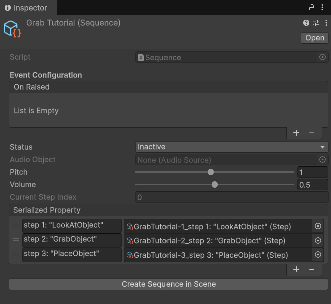

# Sequence System — Quick Start Guide

> **Quick Reference**
> **Menu Path:** Assets > Create > Shababeek > Sequencing > Sequence
> **Use For:** Tutorials, quests, guided workflows, multi-step processes
> **Requires:** SequenceBehaviour component in scene

---

## What It Does

The **Sequence System** manages ordered, multi-step processes like tutorials, quests, or interactive guides. Each step can:

- ✅ Play audio narration
- ✅ Trigger Unity events
- ✅ Wait for player actions (gaze, grab, button press, etc.)
- ✅ Chain automatically to the next step

---

## Core Concepts

| Term | Description |
|------|-------------|
| **Sequence** | ScriptableObject containing ordered Steps |
| **Step** | Single stage with events and completion conditions |
| **SequenceBehaviour** | Scene component that runs a Sequence |
| **StepEventListener** | Bridges step events to Unity events |
| **Action** | Component that completes a step when condition is met |

---

## 5-Minute Setup

### Step 1: Create a Sequence Asset

1. Right-click in Project window
2. **Create > Shababeek > Sequencing > Sequence**
3. Name it (e.g., "TutorialSequence")

### Step 2: Add Steps

1. Select your Sequence asset
2. Click **+** to add steps
3. Rename steps by clicking the name field
4. Drag to reorder



### Step 3: Add to Scene

**Option A: Use Editor Button**
1. Select your Sequence asset
2. Click **"Create Sequence in Scene"** button
3. Done! Creates SequenceBehaviour + StepEventListener

**Option B: Manual Setup**
1. Create empty GameObject
2. Add **SequenceBehaviour** component
3. Assign your Sequence asset
4. Enable **Start On Awake** (optional)

### Step 4: Add Actions to Steps

For each step that needs a completion condition:

1. Create child GameObject under your sequence object
2. Add an Action component (e.g., TimerAction, GazeAction)
3. Assign the corresponding Step reference

---

## Basic Example: 3-Step Tutorial

```
Sequence: "GrabTutorial"
├── Step 1: "LookAtObject"     → GazeAction (look at cube)
├── Step 2: "GrabObject"       → InteractionAction (grab the cube)
└── Step 3: "PlaceObject"      → InsertionAction (place in target)
```

### Scene Hierarchy

```
TutorialSequence
├── SequenceBehaviour (sequence = GrabTutorial)
├── StepEventListener (all steps configured)
├── Step1_LookAction
│   └── GazeAction (step = LookAtObject, target = Cube)
├── Step2_GrabAction
│   └── InteractionAction (step = GrabObject, interactable = Cube)
└── Step3_PlaceAction
    └── InsertionAction (step = PlaceObject, socket = TargetSocket)
```

---

## Step Configuration

| Setting | Description |
|---------|-------------|
| **Audio Clip** | Narration to play when step starts |
| **Audio Delay** | Seconds to wait before playing audio |
| **Audio Only** | Auto-complete when audio finishes |
| **On Started** | Unity event when step begins |
| **On Completed** | Unity event when step ends |

---

## Available Actions

| Action | Completes When |
|--------|----------------|
| **TimerAction** | Duration elapsed |
| **GazeAction** | Player looks at target for duration |
| **InteractionAction** | Object is grabbed/hovered/activated |
| **GrabHoldAction** | Object held for duration |
| **InsertionAction** | Object placed in socket |
| **ControllerButtonAction** | Button pressed |
| **TriggerAction** | Player enters trigger zone |
| **ProximityAction** | Player within distance of target |
| **AnimationAction** | Animation completes |
| **EventAction** | Custom event raised |

---

## Events & Callbacks

### Via Inspector (StepEventListener)

```
StepEventListener
├── Step 1: LookAtObject
│   ├── On Step Started → [Show highlight on cube]
│   └── On Step Completed → [Hide highlight]
├── Step 2: GrabObject
│   ├── On Step Started → [Show grab prompt]
│   └── On Step Completed → [Hide prompt]
```

### Via Code

```csharp
public class TutorialManager : MonoBehaviour
{
    [SerializeField] private Sequence tutorial;
    private CompositeDisposable _disposable = new();

    void Start()
    {
        // Listen to sequence completion
        tutorial.OnRaisedData
            .Where(s => s == SequenceStatus.Completed)
            .Subscribe(_ => OnTutorialComplete())
            .AddTo(_disposable);

        // Listen to specific step
        var step = tutorial.Steps[0];
        step.OnRaisedData
            .Where(s => s == SequenceStatus.Started)
            .Subscribe(_ => OnFirstStepStarted())
            .AddTo(_disposable);

        tutorial.Begin();
    }

    void OnDestroy() => _disposable.Dispose();
}
```

---

## Runtime Controls

### Start Sequence

```csharp
// Via SequenceBehaviour
sequenceBehaviour.Begin();

// Via Sequence directly
sequence.Begin();
```

### Skip/Complete Step

```csharp
// Complete current step immediately
sequence.CurrentStep.CompleteStep();
```

### Check Progress

```csharp
// Current step index
int index = sequence.CurrentStepIndex;

// Current step reference
Step current = sequence.CurrentStep;

// Is sequence running?
bool running = sequence.Started;
```

---

## Common Patterns

### Audio-Only Steps (Narration)

```
Step: "Introduction"
├── Audio Clip: intro_narration.wav
├── Audio Only: ✓ (auto-completes when audio ends)
└── No action component needed
```

### Timed Steps

```
Step: "WaitForPlayer"
├── Action: TimerAction
│   ├── Step: WaitForPlayer
│   └── Duration: 5.0 seconds
```

### Conditional Steps

```
Step: "GrabAnyObject"
├── Action: MultiConditionAction
│   ├── Mode: Any (complete when any condition met)
│   ├── Condition 1: InteractionAction (Cube)
│   └── Condition 2: InteractionAction (Sphere)
```

---

## Tips

💡 **Test in Editor** — Use the "Next" button in play mode to skip steps.

💡 **Name Steps Clearly** — Steps are named `{Sequence}-{Index}_{Name}` automatically.

💡 **Use Events** — StepEventListener is easier than coding for simple setups.

💡 **One Action Per Step** — Each step should have one primary completion action.

---

## Troubleshooting

| Problem | Cause | Solution |
|---------|-------|----------|
| Sequence doesn't start | Missing SequenceBehaviour | Add component to scene |
| Step never completes | No action or wrong step reference | Check action's Step field |
| Audio doesn't play | No AudioSource | Sequence creates one automatically |
| Events not firing | StepEventListener not configured | Add steps to listener |
| Steps skip too fast | Audio Only enabled | Disable or add action |

---

## Next Steps

- [Sequence System Reference](../Systems/SequencingSystem.md) — Full documentation
- [Interaction-Specific Actions](../Systems/SequencingSystem.md) — All action types for interactions

---

**Last Updated:** January 2026
