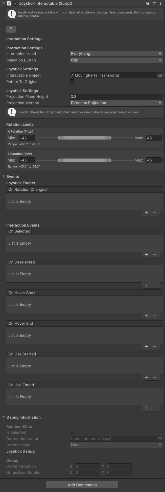
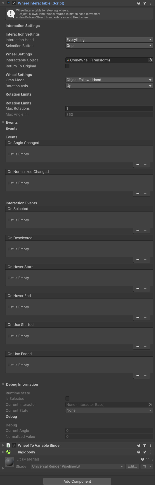
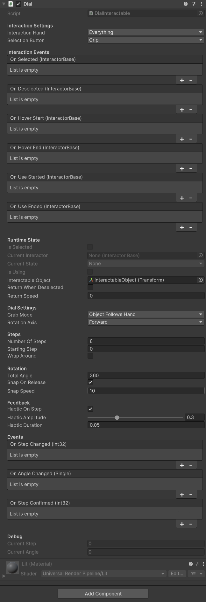

# Constrained Interactables — Lever, Drawer, Joystick, Wheel, Dial

> **Overview**
> Constrained interactables are objects that move in limited, predictable ways when grabbed. Unlike Grabable objects that follow the hand freely, these components restrict movement to specific axes or paths.

---

## Component Overview

| Component | Movement | Degrees of Freedom | Use Cases |
|-----------|----------|-------------------|-----------|
| **Lever** | Rotation around single axis | 1 | Throttles, gear shifts, valves |
| **Drawer** | Linear slide between points | 1 | Drawers, sliding doors, sliders |
| **Joystick** | Rotation around two axes | 2 | Flight sticks, arcade controls |
| **Wheel** | Continuous rotation | 1 | Steering wheels, valves, cranks |
| **Dial** | Discrete step rotation | 1 | Combination locks, rotary selectors |

All constrained interactables share common features:
- PoseConstrainer for hand positioning
- Return-to-origin option
- Normalized output values (0-1 or -1 to 1)
- Unity Events for value changes

### Quick Creation Methods

There are three ways to add constrained interactables to your scene:

**Create with placeholder model** — Right-click in Hierarchy > **Shababeek > Create > [Lever / Drawer / Joystick / Wheel]**. This creates a complete interactable with a placeholder model, ready to test. The object is parented under the selected object at local (0,0,0), or placed at the scene root.

**Convert an existing object** — Right-click on an object > **Shababeek > Make Into > [Lever / Drawer / Joystick / Wheel]**. This adds the interactable component and required PoseConstrainer to your existing object.

**Add Component manually** — Select object > Add Component > search for the interactable type.

---

# Lever Interactable {#lever}

> **Menu Path:** Component > Shababeek > Interactions > Interactables > Lever Interactable
> **Create Menu:** Right-click in Hierarchy > Shababeek > Create > Lever
> **Use For:** Single-axis rotation controls

## What It Does

The Lever rotates around a single axis within defined angle limits. As you move the grabbed lever, it outputs a normalized value (0-1) representing its position between minimum and maximum angles.

<!-- TODO: Add lever-interaction.gif -->
*Lever Interaction animation showing lever rotating through its range of motion*

## Inspector Reference


### Settings

#### Interactable Object
The transform that rotates during interaction.

#### Rotation Axis
Which local axis the lever rotates around.

| Value | Rotation |
|-------|----------|
| **Right** | Around X axis (pitch) |
| **Up** | Around Y axis (yaw) |
| **Forward** | Around Z axis (roll) |

**Default:** Right

#### Angle Range
Minimum and maximum rotation angles in degrees.

**Default:** -40° to 40°

| Value | Meaning |
|-------|---------|
| **X (Min)** | Angle when output is 0 |
| **Y (Max)** | Angle when output is 1 |

#### Projection Distance
Reference distance for angle calculation. Should approximately match the height of the grab point above the pivot.

**Default:** 0.3

Increase if lever feels too sensitive; decrease if sluggish.

#### Return When Deselected
When enabled, lever animates back to starting position after release.

#### Return Speed
How fast the lever returns (when Return When Deselected is enabled).

### Events

#### On Lever Changed (float)
Fires continuously with normalized position (0-1) as lever moves.

**Use for:**
- Controlling throttle percentage
- Adjusting volume/intensity
- Driving animations

### Debug Values

- **Current Angle** — Actual rotation in degrees
- **Current Normalized Angle** — Position as 0-1 value

## Quick Setup

**Fastest:** Right-click in Hierarchy > **Shababeek > Create > Lever** — gives you a ready-to-test lever with placeholder model.

**Manual:**
1. Create lever model with pivot at rotation point
2. **Add Component > Lever Interactable**
3. Assign **Interactable Object** (the rotating part)
4. Set **Rotation Axis** to match model orientation
5. Adjust **Angle Range** for desired limits
6. Wire **On Lever Changed** to target (e.g., Light.intensity)

## Code Example

```csharp
public class ThrottleController : MonoBehaviour
{
    [SerializeField] private LeverInteractable lever;
    [SerializeField] private float maxSpeed = 100f;

    void Start()
    {
        lever.OnLeverChanged
            .Subscribe(value => SetSpeed(value * maxSpeed))
            .AddTo(this);
    }

    void SetSpeed(float speed)
    {
        Debug.Log($"Speed: {speed}");
    }
}
```

---

# Drawer Interactable {#drawer}

> **Menu Path:** Component > Shababeek > Interactions > Interactables > Drawer Interactable
> **Create Menu:** Right-click in Hierarchy > Shababeek > Create > Drawer
> **Use For:** Linear sliding movement between two points

## What It Does

The Drawer slides along a linear path between a start and end position. Perfect for desk drawers, sliding doors, or any sliding mechanism.

<!-- TODO: Add drawer-interaction.gif -->
*Drawer Interaction animation showing drawer sliding open and closed*

## Inspector Reference


### Settings

#### Interactable Object
The transform that moves during interaction.

#### Local Start
Local position when drawer is "closed" (output = 0).

**Default:** (0, 0, 0)

#### Local End
Local position when drawer is "open" (output = 1).

**Default:** (0, 0, 1) — slides forward on Z axis

> 💡 **Tip:** Set these by positioning the drawer closed, copying the local position to Start, then positioning it open and copying to End.

#### Return When Deselected
When enabled, drawer returns to start position after release.

#### Return Speed
How fast the drawer returns.

### Events

#### On Moved (float)
Fires continuously with normalized position (0-1).

#### On Opened
Fires when drawer reaches near-fully-open position (>95%).

#### On Closed
Fires when drawer reaches near-fully-closed position (<5%).

## Quick Setup

**Fastest:** Right-click in Hierarchy > **Shababeek > Create > Drawer** — gives you a ready-to-test drawer with placeholder model.

**Manual:**
1. Create drawer with parent container and child drawer body
2. **Add Component > Drawer Interactable** to parent
3. Assign **Interactable Object** (the drawer body)
4. Position drawer closed, copy local position to **Local Start**
5. Position drawer open, copy local position to **Local End**
6. Wire events as needed

## Code Example

```csharp
public class DrawerContents : MonoBehaviour
{
    [SerializeField] private DrawerInteractable drawer;
    [SerializeField] private GameObject contents;

    void Start()
    {
        drawer.OnOpened
            .Subscribe(_ => contents.SetActive(true))
            .AddTo(this);

        drawer.OnClosed
            .Subscribe(_ => contents.SetActive(false))
            .AddTo(this);
    }
}
```

---

# Joystick Interactable {#joystick}

> **Menu Path:** Component > Shababeek > Interactions > Interactables > Joystick Interactable
> **Create Menu:** Right-click in Hierarchy > Shababeek > Create > Joystick
> **Use For:** Two-axis rotation controls

## What It Does

The Joystick rotates around two axes simultaneously, outputting X and Y values. Perfect for flight controls, vehicle steering, or any two-dimensional input.

<!-- TODO: Add joystick-interaction.gif -->
*Joystick Interaction animation showing joystick tilting on two axes*

## Inspector Reference



### Settings

#### Interactable Object
The transform that rotates.

#### X Angle Range
Rotation limits for X axis (left/right tilt).

**Default:** -30° to 30°

#### Y Angle Range
Rotation limits for Y axis (forward/back tilt).

**Default:** -30° to 30°

#### Return When Deselected
When enabled, joystick springs back to center.

#### Return Speed
How fast joystick returns to center.

### Events

#### On Value Changed (Vector2)
Fires continuously with normalized position.
- X: -1 (left) to 1 (right)
- Y: -1 (back) to 1 (forward)
- (0, 0) = centered

### Debug Values

- **Current X Angle** — X rotation in degrees
- **Current Y Angle** — Y rotation in degrees
- **Normalized Value** — Current Vector2 output

## Quick Setup

**Fastest:** Right-click in Hierarchy > **Shababeek > Create > Joystick** — gives you a ready-to-test joystick with placeholder model.

**Manual:**
1. Create joystick model with pivot at base
2. **Add Component > Joystick Interactable**
3. Assign **Interactable Object**
4. Adjust angle ranges for desired movement
5. Enable **Return When Deselected** for spring-back
6. Wire **On Value Changed** to movement/steering

## Code Example

```csharp
public class AircraftControls : MonoBehaviour
{
    [SerializeField] private JoystickInteractable joystick;
    [SerializeField] private Rigidbody aircraft;

    void Start()
    {
        joystick.OnValueChanged
            .Subscribe(input => ApplyControls(input))
            .AddTo(this);
    }

    void ApplyControls(Vector2 input)
    {
        // input.x = roll, input.y = pitch
        float roll = input.x * 50f;
        float pitch = input.y * 30f;
        aircraft.AddTorque(pitch, 0, -roll);
    }
}
```

---

# Wheel Interactable {#wheel}

> **Menu Path:** Component > Shababeek > Interactions > Interactables > Wheel Interactable
> **Create Menu:** Right-click in Hierarchy > Shababeek > Create > Wheel
> **Use For:** Continuous rotation (valves, steering wheels)

## What It Does

The Wheel rotates continuously around a single axis. Unlike Lever which has angle limits, Wheel can spin indefinitely, tracking total rotation.

<!-- TODO: Add wheel-interaction.gif -->
*Wheel Interaction animation showing wheel rotating continuously*

## Inspector Reference



### Settings

#### Interactable Object
The transform that rotates.

#### Rotation Axis
Which axis the wheel rotates around.

| Value | Common Use |
|-------|------------|
| **Forward** | Steering wheel (facing player) |
| **Up** | Valve (horizontal) |
| **Right** | Crank handle |

#### Max Rotations (Optional)
Limit total rotations. Set to 0 for unlimited.

#### Return When Deselected
When enabled, wheel returns to starting rotation.

#### Return Speed
How fast wheel returns.

### Events

#### On Rotation Changed (float)
Fires with current rotation in degrees (can exceed 360°).

#### On Normalized Changed (float)
Fires with rotation normalized to 0-1 (based on Max Rotations, or per-revolution if unlimited).

### Debug Values

- **Current Rotation** — Total rotation in degrees
- **Rotations** — Number of complete rotations

## Quick Setup

**Fastest:** Right-click in Hierarchy > **Shababeek > Create > Wheel** — gives you a ready-to-test wheel with placeholder model.

**Manual:**
1. Create wheel model with pivot at center
2. **Add Component > Wheel Interactable**
3. Assign **Interactable Object**
4. Set **Rotation Axis** to match wheel orientation
5. Optionally set **Max Rotations** for limited turning
6. Wire events to target systems

## Code Example

```csharp
public class ValveController : MonoBehaviour
{
    [SerializeField] private WheelInteractable valve;
    [SerializeField] private float maxFlow = 10f;
    [SerializeField] private float maxRotations = 5f;

    void Start()
    {
        valve.OnRotationChanged
            .Subscribe(rotation => {
                float normalized = Mathf.Clamp01(rotation / (maxRotations * 360f));
                float flow = normalized * maxFlow;
                Debug.Log($"Flow rate: {flow}");
            })
            .AddTo(this);
    }
}
```

---

# Dial Interactable {#dial}

> **Menu Path:** Component > Shababeek > Interactions > Interactables > Dial
> **Use For:** Discrete step rotation (combination locks, rotary selectors)

## What It Does

The Dial rotates between discrete positions (steps), snapping to the nearest step when released. Unlike Wheel which outputs continuous rotation, Dial outputs an integer step index.

<!-- TODO: Add dial-interaction.gif -->
*Dial Interaction animation showing dial rotating and snapping to discrete positions*

## Inspector Reference



### Settings

#### Interactable Object
The transform that rotates.

#### Grab Mode
How the object behaves when grabbed.

| Value | Description |
|-------|-------------|
| **ObjectFollowsHand** | Dial snaps to hand position on grab |
| **HandFollowsObject** | Hand position follows dial rotation |

#### Rotation Axis
Which axis the dial rotates around.

| Value | Common Use |
|-------|------------|
| **Forward** | Safe dial (facing player) |
| **Up** | Control knob (horizontal) |
| **Right** | Side-mounted selector |

#### Number Of Steps
How many discrete positions on the dial (minimum 2).

**Examples:**
- Safe dial: 10 or 100 steps
- Mode selector: 3-5 steps
- Volume knob: 10 steps

#### Starting Step
Initial step index (0-based).

#### Wrap Around
Allow continuous rotation past the last step to wrap to the first.

- **Enabled**: Step 9 → Step 0 (continuous)
- **Disabled**: Step 9 stops at max

#### Total Angle
Total rotation angle covered by all steps.

**Examples:**
- 360° — Full rotation dial
- 270° — 3/4 rotation knob
- 180° — Half rotation selector

#### Snap On Release
When enabled, dial animates to nearest step when released.

#### Snap Speed
Animation speed for snapping.

#### Haptic Feedback
Enable haptic pulse when passing through steps.

### Events

#### On Step Changed (int)
Fires when the current step changes. Passes the new step index (0-based).

**Use cases:**
- Update UI display
- Change mode/setting
- Trigger per-step sounds

#### On Angle Changed (float)
Fires continuously as the dial rotates. Passes the current angle.

**Use cases:**
- Visual feedback during rotation
- Audio pitch adjustment

#### On Step Confirmed (int)
Fires when a step is confirmed (on release with snapOnRelease, or immediately without).

**Use cases:**
- Confirm combination digit
- Apply setting change
- Play confirmation sound

### Debug Values

- **Current Step** — Current step index (0-based)
- **Current Angle** — Current rotation angle

## Quick Setup

1. Create dial model with pivot at center
2. **Add Component > Dial Interactable**
3. Assign **Interactable Object**
4. Set **Number Of Steps** (e.g., 10 for 0-9 dial)
5. Set **Total Angle** (e.g., 360° for full rotation)
6. Enable **Snap On Release** for discrete positions
7. Wire **On Step Changed** event to your logic

## Code Example

```csharp
public class CombinationLock : MonoBehaviour
{
    [SerializeField] private DialInteractable[] dials;
    [SerializeField] private int[] combination = { 3, 7, 1 };

    void Start()
    {
        foreach (var dial in dials)
        {
            dial.OnStepConfirmed
                .Subscribe(_ => CheckCombination())
                .AddTo(this);
        }
    }

    void CheckCombination()
    {
        for (int i = 0; i < dials.Length; i++)
        {
            if (dials[i].CurrentStep != combination[i])
                return; // Wrong combination
        }

        Debug.Log("Lock opened!");
        // Unlock logic here
    }
}
```

## Binder Integration

Use **DialToVariableBinder** to connect dial output to the Scriptable System:

```csharp
// Dial outputs:
// - Step as IntVariable
// - Normalized value (0-1) as FloatVariable
// - Per-step GameEvents
```

---

## Common Base Features

All constrained interactables inherit from **ConstrainedInteractableBase** and share:

### PoseConstrainer Integration
Each constrained interactable requires a PoseConstrainer for hand positioning. This is automatically added when you add the component.

Configure the PoseConstrainer to:
- Position hand correctly on the control
- Set appropriate finger poses
- Enable smooth transitions for polish

### Return Behavior
All constrained interactables support returning to their original position:

| Setting | Behavior |
|---------|----------|
| **Return When Deselected** | Enables/disables return |
| **Return Speed** | Controls animation speed |

### Scale Compensation
Constrained interactables automatically handle scaled objects. The internal ScaleCompensator ensures correct hand positioning regardless of parent scale.

---

## Comparison Table

| Feature | Lever | Drawer | Joystick | Wheel | Dial |
|---------|-------|--------|----------|-------|------|
| **Movement** | Rotation | Linear | Rotation | Rotation | Rotation |
| **Axes** | 1 | 1 | 2 | 1 | 1 |
| **Output Type** | Float | Float | Vector2 | Float | Int (step) |
| **Discrete** | No | No | No | No | Yes |
| **Limited** | Yes (angle) | Yes (position) | Yes (angle) | Optional |
| **Output Type** | float (0-1) | float (0-1) | Vector2 | float (degrees) |
| **Return Option** | ✓ | ✓ | ✓ | ✓ |
| **Events** | OnChanged | OnMoved, OnOpened, OnClosed | OnValueChanged | OnRotationChanged |

---

## Tips & Best Practices

💡 **Set up hand poses**
Each control type benefits from appropriate PoseConstrainer settings. A throttle lever needs different finger positions than a steering wheel.

💡 **Use return for spring controls**
Joysticks and momentary levers should return to center. Throttles and valves typically shouldn't.

💡 **Test sensitivity**
Adjust Projection Distance (Lever) or angle ranges to get the right feel. VR controls often need less sensitivity than you'd expect.

💡 **Wire audio feedback**
Add subtle sounds to enhance physicality — clicks, friction sounds, mechanism noises.

💡 **Consider detents**
For stepped controls, add script logic to snap to discrete positions (using OnChanged values).

---

## Troubleshooting

| Problem | Cause | Solution |
|---------|-------|----------|
| Control doesn't move | Interactable Object not assigned | Assign the moving transform |
| Moves wrong direction | Axis misconfigured | Try different Rotation Axis values |
| Hand position wrong | PoseConstrainer not configured | Adjust hand positioning settings |
| Too sensitive | Ranges too large | Reduce angle ranges or increase projection distance |
| Not sensitive enough | Ranges too small | Increase angle ranges |
| Snaps back too fast | Return Speed too high | Lower the Return Speed value |

---

## Related Documentation

- [PoseConstrainer](../PoseSystem/PoseConstrainer.md) — Hand positioning setup
- [Grabable](Grabable.md) — Free-movement grabbing
- [Switch](Switch.md) — Trigger-based toggles
- [Feedback System](../Systems/FeedbackSystem.md) — Add feedback effects
- [Quick Start Guide](../GettingStarted/QuickStart.md) — Basic setup tutorials

---

**Last Updated:** January 2026
**Component Version:** 1.0.0
