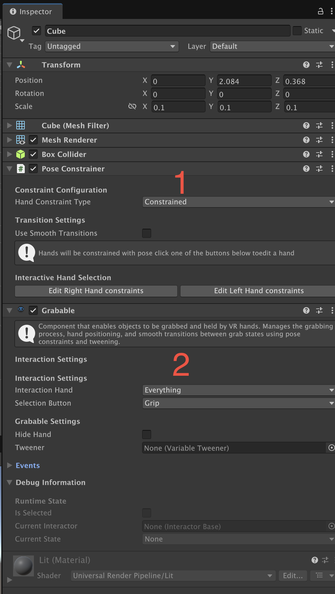
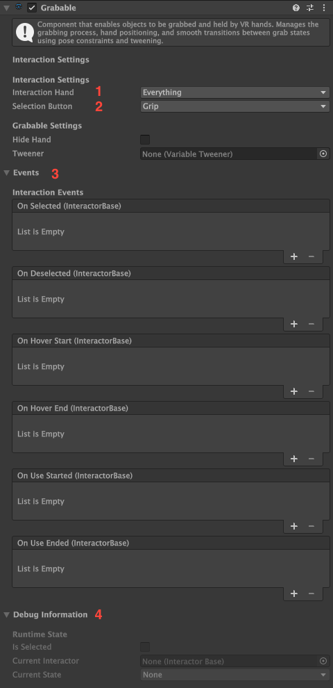

# Grabable — Manual

> **Quick Reference**  
> **Menu Path:** Component > Shababeek > Interactions > Interactables > Grabable  
> **Use For:** Making objects that can be picked up and held  
> **Requires:** Collider component, PoseConstrainer component (added automatically)

---

## What It Does

The Grabable component makes any GameObject pickable. When a player reaches out and grabs the object, it attaches to their hand and follows their movement. Release the grip button, and the object drops or is placed down.

Perfect for creating tools, weapons, toys, or any object your player needs to pick up and manipulate in VR.

**Common Uses:**
- ✅ Tools the player can pick up (hammer, flashlight, key)
- ✅ Throwable objects (balls, grenades, rocks) _but needs to also add [Throwable](Throwable.md)_
- ✅ Weapons that need to be held (sword, gun, bow)
- ✅ Interactive props (phone, book, remote control)
  **Don't use for**:
- ❌ Buttons, switches, or objects that shouldn't move (use Switch or VRButton instead)
- ❌ Object that move with a constraint (Drawer, Lever, Joystick, Wheels, ...)
---

## Quick Example

> **Goal:** Make a cube you can pick up and throw


This example shows a basic grabbable Object. The player can pick it up, move it around, and throw it. You'll learn the essential settings needed for any grabbable object.

---

## Adding to Your Scene

### Step 1: Prepare Your GameObject
1. Select or create the GameObject you want to make grabbable
2. **Important:** The object must have a **Collider** component
3. For primitive Unity Shapes (cube,Sphere,Capsul,...) make sure to scale them to a size that makes sense a cube is (1m,1m,1m) your hand can't hold such object
4. For physics objects: Add a **Rigidbody** and Throwable components



> 💡 **Note:**
> - Without a Collider, the hand can't detect the object.
> - Without a Rigidbody, the object will float mid-air when you leave it.
> - Without a Throwable The object will not follow the trajectory of the hand when thrown

### Step 2: Add the Component
#### From Add component Menu
1. With your GameObject selected, click **Add Component**
2. Type `Grabable` in the search, or navigate to `Shababeek > Interactions > Interactables > Grabable`
3. Click to add it
#### By Using the Make into Option
1. Right-click on the Object in the hierarchy
2. Select `Shababeek -> Make into -> Grabable`
   

### Step 3: Automatic Setup
When you add Grabable, Unity automatically:
- ✅ Adds a **PoseConstrainer** component (for hand positioning)
- ✅ Detects if you have a Rigidbody and chooses the right grab strategy
- ✅ Sets default interaction settings

Your object is now grabbable with default settings! Press Play and try grabbing it with your VR controller's grip button.

---

## Inspector Reference


### 🎯 Interaction Settings

#### 1. Interaction Hand
- **What it does:** Controls which hand(s) can grab this object
- **Default:** Both
- **Options:**
  - **Both:** Either hand can grab it
  - **Left:** Only left hand
  - **Right:** Only right hand
  - **None:** If you want to cancel Interactions for this Object
- **When to change:**
  - Use **Both** for most objects (recommended)
  - Set to **Left** for left-handed tools (if your game has handedness)
  - Set to **Right** for right-handed tools

#### 2. Selection Button
- **What it does:** The controller button that grabs/releases the object
- **Default:** Grip
- **Options:**
  - **Grip:** Side grip button (recommended for grab interactions)
  - **Trigger:** Index finger trigger
- **When to change:**
  - Use **Grip** for picking up objects (feels natural)
  - Use **Trigger** if grip is used for small objects(pins, pebbles, ...) or for other mechanics like dragging a slingshot string


> 💡 **Best Practice:** Keep Grab on **Grip** unless the object real-life counterpart is usually held with indexFinger/Thumb.

---

#### 3. Events 📢

Events let you trigger actions when the object is grabbed, released, or used.

##### a. On Selected
- **When it fires:** The moment the player grabs the object
- **Common uses:**
  - Play a "grab" sound effect
  - Change the object's material (highlight)
  - Haptic feedback (vibrate controller)
  - Show UI hints ("Press Trigger to use")
  - trigger a trap when the player Grabs the treasure

**Example Setup:**
1. Expand the **On Selected** event
2. Click the **+** button
3. Drag your **AudioSource** (or other component) to the Object field
4. Select **AudioSource > Play()**

##### b. On Deselected
- **When it fires:** When the player releases the object
- **Common uses:**
  - Play a "drop" sound
  - Remove highlighting
  - Hide UI hints
  - Reset object color

##### c. On Hover Start
- **When it fires:** When the hand gets close enough to grab (before grabbing)
- **Common uses:**
  - Outline/highlight the object
  - Show "Press Grip to grab" hint
  - Play subtle hover sound

##### d. On Hover End
- **When it fires:** When the hand moves away without grabbing
- **Common uses:**
  - Remove outline/highlight
  - Hide grab hint

##### e. On Use Started / On Use Ended
- **When it fires:** When the **Trigger** button is pressed/released while holding
- **Common uses:**
  - Fire a weapon
  - Turn on a flashlight
  - Activate a tool's function
  - Open a phone screen


---

#### 4.  Debug Information 🐛 (Runtime Only)

These fields show the object's state while in Play mode. You can't edit them.

##### a. Is Selected
- **Shows:** Whether the object is currently being held (true/false)
- **Useful for:** Checking if grab is working correctly

##### b. Current Interactor
- **Shows:** Which hand/interactor is holding the object
- **Useful for:** Debugging multi-hand scenarios

##### c. Current State
- **Shows:** None, Hovering, Selected, or Activating
- **Useful for:** Understanding the interaction flow


---

## Common Workflows

### How To: Make a Basic Grabbable Object

> **Goal:** Create a simple object you can pick up  
> **Time:** ~2 minutes

#### Step 1: Create Your Object
1. **GameObject > 3D Object > Cube** (or any shape)
2. Scale it down to a size that makes sense to be held in hand (ex: 0.2,0.2,0.2)
3. The Cube already has a **Box Collider** ✅

#### Step 2: Add Physics [optional]
1. Select the Cube
2. **Add Component > Rigidbody**
3. Leave all settings at default
#### Step 3: Add Throwable [optional]
1. Select the Cube
2. **Add Component > Throwable**
3. Leave all settings at default

#### Step 4: Make It Grabbable
1. **Add Component > Grabable**
2. That's it! Grabable automatically adds PoseConstrainer


#### ✅ Result


Press Play! Put on your VR headset, reach for the cube, and press the **Grip** button. You can now move it around and throw it by releasing grip while moving your hand!

---

### How To: Add Grab Sound Effects

> **Goal:** Play a sound when picking up an object  
> **Time:** ~3 minutes

#### Step 1: Add Audio Source
1. Select your grabbable object
2. **Add Component > Audio Source**
3. **Uncheck** "Play On Awake"
4. Drag your grab sound into the **AudioClip** field

#### Step 2: Wire Up the Event
1. On the **Grabable** component, expand **On Selected**
2. Click the **+** button
3. Drag your **GameObject** (the one with Audio Source) into the Object field
4. Click the function dropdown: **AudioSource > Play()**


#### Step 3: Add Release Sound (Optional)
1. Add another **Audio Source** component
2. Assign your drop/release sound
3. Wire **On Deselected** to this Audio Source's Play() function


#### ✅ Result


Now your object plays a sound when grabbed and released!

---

### How To: Make an Object Only Grabbable by Right Hand

> **Goal:** Restrict object to right hand only  
> **Time:** ~30 seconds

#### Step 1: Change Interaction Hand
1. Select your Grabable object
2. In the Grabable component, find **Interaction Hand**
3. Change from **Both** to **Right**


#### ✅ Result
Now only the right hand can grab this object. Left hand will pass through it.

**Use case examples:**
- Right-handed tools (scissors, computer mouse)
- Hand-specific weapons
- Tutorial levels teaching hand-specific actions

---

### How To: Make a Throwable Object

> **Goal:** Create an object that can be thrown with proper physics  
> **Time:** ~3 minutes  
> **Prerequisites:** Basic grabbable setup complete

#### Step 1: Set Up the Base
1. Follow the "Make a Basic Grabbable Object" workflow first
2. Your object needs a **Rigidbody** (check!)

#### Step 2: Adjust Rigidbody Settings
These settings make throwing feel good:

1. **Mass:** 0.5 to 2 (lighter = easier to throw far)
2. **Drag:** 0.1 to 0.5 (higher = slows down in air)
3. **Angular Drag:** 0.5 (prevents spinning too much)


#### ✅ Result


Your object now throws realistically! The Grabable automatically calculates release velocity from your hand's movement.

> 💡 **Tip:** If throws feel too weak or too strong, adjust the **Mass** and drag.

---

### How To: Create a Tool with an Action Button

> **Goal:** Make a flashlight that turns on with Trigger while held  
> **Time:** ~5 minutes

#### Step 1: Set Up Base Flashlight
1. Create your flashlight model (or use a cylinder as placeholder)
2. **Add Component > Grabable**
3. Add a **Light** component to the flashlight
4. **Disable** the Light (uncheck the checkbox)


#### Step 2: Create Toggle Script
This simple script toggles the light:

```csharp
using UnityEngine;

public class FlashlightToggle : MonoBehaviour
{
    [SerializeField] private Light flashlight;
    
    public void ToggleLight()
    {
        flashlight.enabled = !flashlight.enabled;
    }
}
```


#### Step 3: Add and Configure Script
1. **Add Component** > FlashlightToggle (your script)
2. Drag the Light component into the **Flashlight** field

#### Step 4: Wire to Use Event
1. On Grabable, expand **On Use Started**
2. Click **+**
3. Drag the flashlight GameObject to the Object field
4. Select **FlashlightToggle > ToggleLight()**


#### ✅ Result


Grab the flashlight (Grip), then press **Trigger** to turn it on/off!

---


## Combine With...

### → Throwable Component
Grabable works great with the **Throwable** component for advanced throwing mechanics.

**Example:** Create a baseball that tracks throw speed and shows a trail effect.


### → Socket Component
Use with **Sockets** to create places where objects can be placed and held.
**Example:** Tool rack where tools snap into place when released nearby.

### → Sequence System
Combine with **Sequences** for tutorial scenarios.
**Example:** "Pick up the key, insert it in the lock" tutorial step.

---

## Tips & Best Practices

💡 **Tip 1: Always Test Mass Settings**  
**Why:** Mass dramatically affects how objects feel. Too light = floaty. Too heavy = unresponsive. Test and adjust!

💡 **Tip 2: Use Hover Events for Clarity**  
**Why:** Highlighting objects when hands get close tells players "this is grabbable!" Essential for good VR UX.

💡 **Tip 3: Configure PoseConstrainer for Each Object Type**  
**Why:** Default hand pose doesn't fit all objects. A screwdriver needs different finger positions than a ball.

💡 **Tip 4: Keep Colliders Simple**  
**Why:** Complex mesh colliders slow down physics. Use primitive shapes (box, sphere, capsule) whenever possible.

💡 **Tip 5: Test Throwing in VR, Not Desktop**  
**Why:** Throwing feels completely different in VR. What works in Scene view may feel wrong in headset.

⚠️ **Common Mistake:** Forgetting to add a Collider  
**Instead:** Grabable requires a Collider to detect hand proximity. Add one first!

⚠️ **Common Mistake:** Making everything grabbable  
**Instead:** Only objects the player should pick up need Grabable. Use InteractableBase for buttons, levers, etc.

---

## Troubleshooting

| You See This... | Try This... |
|----------------|-------------|
| Object doesn't highlight when hand approaches | **Check:** Does the object have a Collider?<br>**Then:** Verify Interaction Layers match in Config asset<br>**Solution:** Add or enable the Collider component |
| Can't grab the object even when touching it | **Cause:** Collider might be a Trigger<br>**Fix:** Uncheck "Is Trigger" on the Collider<br>**Or:** Check that Selection Button matches your controller input |
| Object feels "slippery" or slides in hand | **Common cause:** Missing or improperly configured PoseConstrainer<br>**Steps:** 1. Check PoseConstrainer exists 2. Set Constraint Type to "Constrained" 3. Configure hand positioning |
| Object flies away randomly when released | **Cause:** Rigidbody is receiving too much velocity<br>**Fix:** 1. Lower **Mass** 2. Increase **Drag** 3. Check for collisions with other objects at release point |
| Can't throw object / no velocity on release | **Check:** Object must have a Rigidbody<br>**Then:** Verify Grab Strategy is **RigidBodyGrabStrategy**<br>**Solution:** Add Rigidbody component or check Grab Strategy setting |
| Wrong hand pose when grabbing | **Cause:** PoseConstrainer not configured for this object type<br>**Fix:** 1. Select the object 2. Find PoseConstrainer component 3. Set Target Pose Index to appropriate pose (0=Open, 1=Fist, etc.) |

---

## Scripting API

> **For Programmers:** Access Grabable in code

### Key Properties
```csharp
// Check if object is being held
public bool IsSelected { get; }

// Get the hand/interactor holding this
public InteractorBase CurrentInteractor { get; }

// Current interaction state
public InteractionState CurrentState { get; }
```

### Useful Methods
```csharp
// Programmatically force drop
public void ForceRelease()

// Check if can be grabbed
public bool CanBeGrabbed(InteractorBase interactor)
```

### Example Code
```csharp
using Shababeek.Interactions;

public class GrabableExample : MonoBehaviour
{
    [SerializeField] private Grabable grabable;
    
    private void Update()
    {
        if (grabable.IsSelected)
        {
            Debug.Log($"Being held by: {grabable.CurrentInteractor.name}");
        }
    }
    
    public void DropIfHeld()
    {
        if (grabable.IsSelected)
        {
            grabable.ForceRelease();
        }
    }
}
```

For complete API documentation, see [ScriptingReference.md](../ScriptingReference/Readme.md).

---

## Technical Details

### Performance Considerations
- Grabable uses continuous collision detection while held (higher CPU cost)
- Limit the number of simultaneously grabbed objects (typically not an issue)
- Simple colliders (Box, Sphere, Capsule) perform better than Mesh Colliders

### How It Works (Under the Hood)
When you grab an object:
1. Grabable receives OnSelected from your Hand/Interactor
2. If Rigidbody exists: Makes it kinematic, parents to hand
3. PoseConstrainer applies configured hand pose
4. Grabable follows hand position each frame
5. On release: Re-enables physics, applies release velocity

### Compatibility
- **Unity Version:** 2021.3 or newer (Unity 6 recommended)
- **Dependencies:**
  - Unity Input System/ or Input Manager (see config.md)
  - PoseConstrainer (added automatically)
  - InteractableBase (inherited)
- **Platforms:** All platforms (PC VR, Quest, PSVR, etc.)


---

## Related Topics

- [Readme.md](Readme.md) - A list of a all interactables including grab objects
- [Throwable](Throwable.md) - Advanced throwing mechanics
- [PoseConstrainer](../PoseSystem/PoseConstrainer.md) - Hand pose configuration
- [Socket](../SocketSystem/Readme.md) - Object placement and snapping
- [Getting Started Guide](../GettingStarted/QuickStart.md) - Your first grabbable object
- [Video: Creating Grabbable Objects](link-to-video)

---

## Feedback

Found an issue with this documentation? Have a suggestion? [Submit feedback here](link-to-feedback)

---

**Last Updated:** October 2025  
**Component Version:** 1.0.0