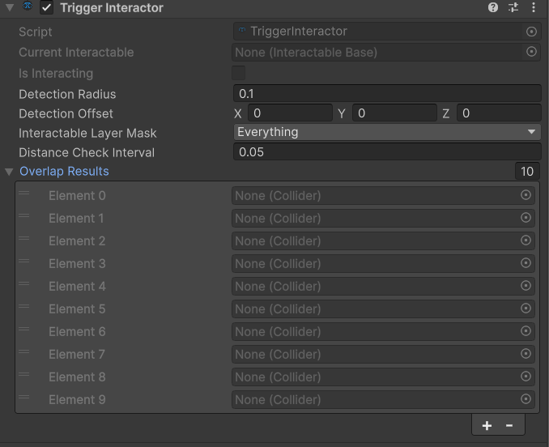
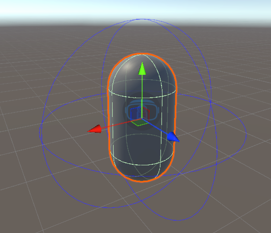
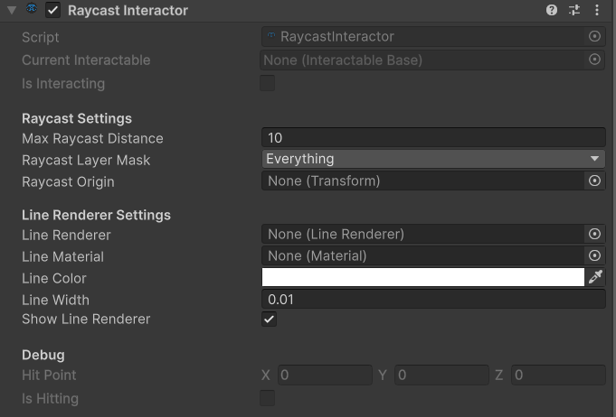

# Interactors — Interaction Detection Components

> **Overview**
> Interactors are components that detect interactable objects and handle the actual grabbing/selection. They are typically attached to hands or controllers.

---

## Interactor Types

| Component | Detection Method | Use Case |
|-----------|-----------------|----------|
| **TriggerInteractor** | Sphere overlap | Close-range grabbing, natural hand interaction |
| **RaycastInteractor** | Ray projection | Distance selection, UI interaction, pointing |

---

# TriggerInteractor {#trigger-interactor}

> **Menu Path:** Component > Shababeek > Interactions > Interactors > Trigger Interactor
> **Use For:** Natural close-range grabbing with hands

## What It Does

The **TriggerInteractor** uses sphere-based detection (Physics.OverlapSphere) to find nearby interactable objects. It continuously scans for the closest interactable within its detection radius.

**How It Works:**
1. Creates a detection sphere at specified position
2. Finds all colliders within the sphere
3. Identifies the closest valid interactable
4. Manages hover state automatically

---

## Inspector Reference



### Settings

#### Detection Radius
Radius of the detection sphere in world units.

| Value | Description |
|-------|-------------|
| **0.05** | Very close, precise detection |
| **0.1** | Normal hand detection (default) |
| **0.2** | Generous, forgiving detection |

**Default:** 0.1

---

#### Detection Offset
Local offset from the interactor's transform to the detection sphere center.

**Default:** (0, 0, 0)

Use this to position the detection area at fingertips or palm center.

---

#### Interactable Layer Mask
Which physics layers to detect.

**Default:** Everything (-1)

For better performance, set this to only your Interactable layer.

---

#### Distance Check Interval
How often (in seconds) to run detection.

| Value | Description |
|-------|-------------|
| **0.02** | Very responsive, higher CPU |
| **0.05** | Balanced (default) |
| **0.1** | Less responsive, lower CPU |

**Default:** 0.05

---

## Setup

1. Select your hand/controller object
2. **Add Component > Trigger Interactor**
3. Set **Detection Radius** for desired range
4. Adjust **Detection Offset** to position at fingertips
5. Set **Interactable Layer Mask** to your interactable layer

---

## Gizmos

In Scene view, TriggerInteractor shows:
- **Blue wire sphere:** Detection area
- **Blue line:** Offset from transform to detection center
- **Blue dot:** Detection center point



---

# RaycastInteractor {#raycast-interactor}

> **Menu Path:** Component > Shababeek > Interactions > Interactors > Raycast Interactor
> **Use For:** Distance-based selection with visual pointer

## What It Does

The **RaycastInteractor** projects a ray from a specified origin point to detect interactables at a distance. It includes a built-in LineRenderer for visual feedback.

**How It Works:**
1. Casts a ray from the origin point forward
2. Detects interactables along the ray
3. Manages hover state for hit objects
4. Updates visual line to show ray path

---

## Inspector Reference



### Raycast Settings

#### Max Raycast Distance
Maximum reach of the raycast in world units.

**Default:** 10

---

#### Raycast Layer Mask
Which physics layers the ray can hit.

**Default:** Everything (-1)

---

#### Raycast Origin
Transform to use as ray origin. If not set, uses the interactor's transform.

**Default:** null (uses self)

---

### Line Renderer Settings

#### Line Renderer
Reference to the LineRenderer component. Auto-created if not present.

---

#### Line Material
Material used for the line visualization.

---

#### Line Color
Color when not hitting any interactable.

**Default:** White

When hitting an interactable, automatically changes to green.

---

#### Line Width
Width of the line in world units.

**Default:** 0.01

---

#### Show Line Renderer
Toggle to show/hide the visual ray.

**Default:** true

---

### Debug (Read-Only)

#### Hit Point
World position where the ray hit an object.

#### Is Hitting
Whether the ray is currently hitting something.

---

## Setup

1. Select your controller object
2. **Add Component > Raycast Interactor**
3. Set **Max Raycast Distance** for desired reach
4. Optionally assign **Raycast Origin** (e.g., fingertip transform)
5. Configure line appearance if desired

---

## Scripting API

```csharp
RaycastInteractor raycast = GetComponent<RaycastInteractor>();

// Toggle line visibility
raycast.SetLineRendererVisibility(false);

// Change line color
raycast.SetLineColor(Color.blue);

// Change max distance
raycast.SetMaxDistance(20f);

// Change layer mask
raycast.SetRaycastLayerMask(LayerMask.GetMask("Interactable"));
```

---

# InteractorBase (Common Features)

Both interactor types inherit from **InteractorBase** and share these features:

## Common Properties

| Property | Description |
|----------|-------------|
| `CurrentInteractable` | Currently hovered interactable (or null) |
| `IsInteracting` | Whether currently interacting with an object |
| `Hand` | Reference to the Hand component |
| `HandIdentifier` | Left or Right hand identifier |

## Common Methods

| Method | Description |
|--------|-------------|
| `StartHover()` | Begins hover state on current interactable |
| `EndHover()` | Ends hover state on current interactable |
| `SelectCurrent()` | Selects/grabs the current interactable |
| `DeselectCurrent()` | Deselects/releases the current interactable |
| `ToggleHandModel(bool)` | Shows/hides the hand model |

## Events

Interactors communicate with interactables via the interactable's event system. See [Grabable documentation](../Interactables/Grabable.md) for event details.

---

## Choosing Between Interactors

| Scenario | Recommended |
|----------|-------------|
| Natural hand grabbing | TriggerInteractor |
| Pointing at distant objects | RaycastInteractor |
| UI interaction | RaycastInteractor |
| Tool tips/fingertip detection | TriggerInteractor |
| Teleportation targeting | RaycastInteractor |
| Close-range manipulation | TriggerInteractor |

### Using Both Together

You can use both interactors simultaneously:

```
Hand
├── TriggerInteractor (for close grabbing)
└── RaycastInteractor (for distant pointing)
```

Configure your input to switch between them or use both based on context.

---

## Tips & Best Practices

💡 **Layer masks for performance**
Always set layer masks to only include interactable layers. Reduces unnecessary physics queries.

💡 **Position detection at fingertips**
For TriggerInteractor, offset detection to fingertip position for natural feel.

💡 **Adjust radius for comfort**
VR requires forgiving detection. Start with larger radii and reduce if too sensitive.

💡 **Consider check intervals**
Balance responsiveness vs performance with the check interval setting.

💡 **Use gizmos for debugging**
Both interactors draw helpful gizmos. Select them in Scene view to see detection areas.

---

## Troubleshooting

| Problem | Cause | Solution |
|---------|-------|----------|
| Objects not detected | Layer mask wrong | Set mask to include interactable layer |
| Detection too sensitive | Radius too large | Reduce detection radius |
| Detection not sensitive enough | Radius too small | Increase detection radius |
| Ray not showing | Show Line Renderer off | Enable Show Line Renderer |
| Ray wrong direction | Origin transform wrong | Check raycast origin transform |
| Laggy detection | Interval too high | Reduce distance check interval |

---

## Related Documentation

- *Hand System (coming soon)* — Hand components
- [Grabable](../Interactables/Grabable.md) — What interactors detect
- [PoseConstrainer](../PoseSystem/PoseConstrainer.md) — Hand positioning
- [Config](../Core/config.md) — Layer configuration

---

**Last Updated:** January 2026
**Component Version:** 1.0.0
