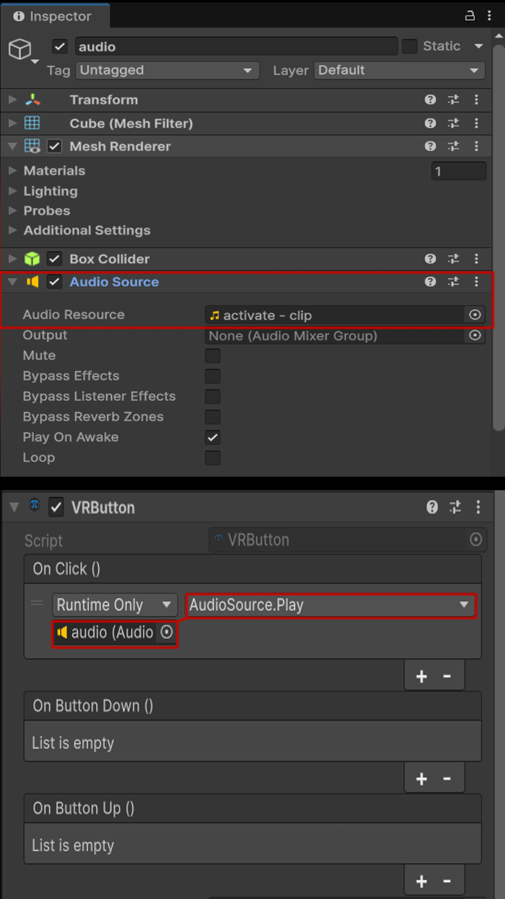
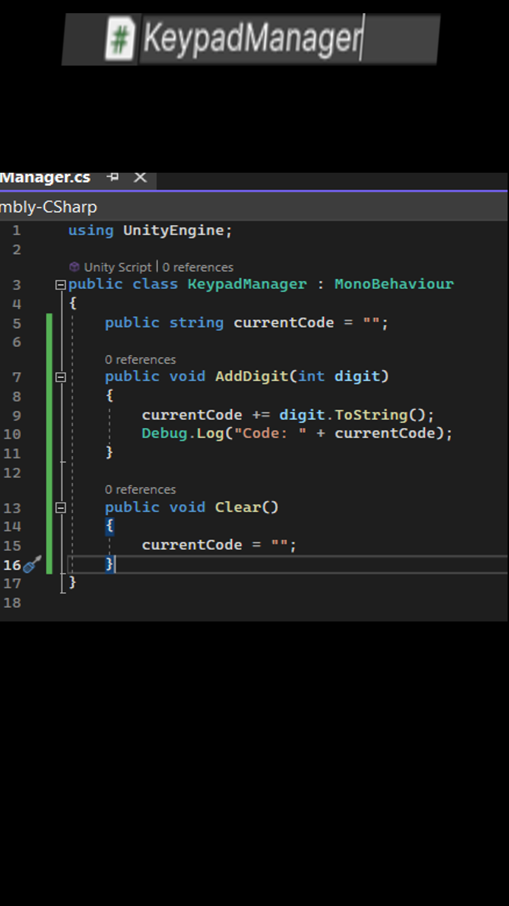

# VRButton — Physical Press Button

> **Quick Reference**
> **Menu Path:** Component > Shababeek > Interactions > Interactables > VRButton
> **Use For:** Buttons that respond to finger/hand presses
> **Requires:** Collider component (set as Trigger)

---

## What It Does

The **VRButton** component creates a physical button that responds to trigger collisions. When a hand or finger enters the button's trigger volume, the button visually presses down and fires events. It includes press animation, cooldown prevention, and multiple event types.

**Perfect for:**
- ✅ Control panel buttons
- ✅ Keypad keys
- ✅ Arcade-style buttons
- ✅ Elevator call buttons
- ✅ Any press-to-activate interface

**Don't use for:**
- ❌ Toggle switches (use Switch)
- ❌ Grabbable buttons (use Grabable with events)
- ❌ UI buttons (use Unity UI with XR Ray Interactor)

---

## Quick Example

> **Goal:** Create a button that plays a sound when pressed

<!-- TODO: Add vrbutton-press.gif -->
*VRButton Press animation showing button press and release cycle*

1. Create a button model with a pressable cap
2. Add VRButton component
3. Add a Trigger collider
4. Wire On Click to AudioSource.Play()

---

## Inspector Reference


### Events

#### On Click
Fires when a complete button press cycle finishes (press + release).

**Common uses:**
- Primary button action
- Confirm selections
- Trigger game events

#### On Button Down
Fires the moment the finger first contacts the button.

**Common uses:**
- Immediate response feedback
- Play "button press" sound
- Visual press indication

#### On Button Up
Fires when the finger leaves the button.

**Common uses:**
- Release effects
- End of held actions
- Play "button release" sound

---

### Button Configuration

#### Button
The transform that moves when the button is pressed.

**What to assign:** The child object representing the pressable button cap/top.

> 💡 **Tip:** Create your button with a parent (base/housing) and child (moving cap). Assign the cap here.

---

#### Normal Position
The button's local position when not pressed (rest state).

**Default:** (0, 0.5, 0)

This is where the button sits when idle.

---

#### Pressed Position
The button's local position when fully pressed.

**Default:** (0, 0.2, 0)

This is how far the button travels when pressed.

> 💡 **Tip:** The Y-axis typically represents vertical travel. Adjust based on your button's orientation.

---

#### Press Speed
How fast the button animates between positions.

| Value | Speed |
|-------|-------|
| **5** | Slow, deliberate |
| **10** | Normal (default) |
| **20** | Fast, snappy |

Higher values = quicker button response.

---

#### Cool Down Time
Minimum time (in seconds) between button presses.

**Default:** 0.2 seconds

**Purpose:** Prevents rapid-fire activation from hands bouncing or accidental multi-presses.

| Value | Behavior |
|-------|----------|
| **0** | No cooldown (can spam) |
| **0.1-0.2** | Normal protection |
| **0.5+** | Deliberate, single presses |

---

#### Mask Name
Filter which objects can press the button.

**Default:** "tip"

When set, only colliders whose GameObject name contains this string can activate the button.

**Common uses:**
- "tip" — Only fingertips (prevents palm presses)
- "index" — Only index finger
- "" (empty) — Any collider triggers button

---

### Is Clicked (Runtime)
Shows whether the button is currently in a pressed state.

---

## Adding to Your Scene

### Step 1: Create Button Structure

1. Create an empty GameObject, name it "Button"
2. Add a child for the button housing/base
3. Add a child for the pressable cap
4. Position the cap where it should rest

```
Button (empty)
├── Housing (cylinder or cube, button base)
└── Cap (smaller cylinder, the pressable part)
```

### Step 2: Add Components

1. Select the parent "Button" object
2. **Add Component > VRButton**
3. **Add Component > Box Collider** (or Capsule)
4. Check **Is Trigger** on the collider
5. Size/position collider to cover where fingers will press

### Step 3: Configure Button

1. Drag the **Cap** child into the **Button** field
2. Set **Normal Position** to cap's current local position
3. Set **Pressed Position** (typically same X/Z, lower Y)
4. Adjust **Press Speed** for desired feel
5. Set **Mask Name** to "tip" for fingertip-only activation

### Step 4: Wire Events

1. Expand **On Click** event
2. Click **+**
3. Drag target object (e.g., AudioSource, Light, etc.)
4. Select the method to call



---

## Common Workflows

### How To: Create a Sound Button

> **Goal:** Button that plays a sound when pressed
> **Time:** ~3 minutes

#### Setup
1. Create button structure (parent + cap child)
2. Add VRButton, configure positions
3. Add **AudioSource** to button
4. Assign sound clip, uncheck **Play On Awake**

#### Events
- **On Button Down** → AudioSource.Play()

This plays sound immediately on press, not waiting for release.

---

### How To: Create a Toggle Button

> **Goal:** Button that toggles something on/off
> **Time:** ~3 minutes

VRButton doesn't have built-in toggle state, but you can add it:

#### Option 1: Simple Toggle Script
```csharp
public class ToggleButton : MonoBehaviour
{
    public GameObject target;
    private bool isOn = false;

    public void Toggle()
    {
        isOn = !isOn;
        target.SetActive(isOn);
    }
}
```

Wire **On Click** → ToggleButton.Toggle()

#### Option 2: Use Separate Component
Add a BoolVariable (Scriptable Variable) and wire:
- **On Click** → BoolVariable.Toggle()

---

### How To: Create a Keypad

> **Goal:** Multiple buttons for number input
> **Time:** ~10 minutes

1. Create one button, configure it fully
2. Duplicate for each key (0-9, *, #)
3. Create a KeypadManager script:

```csharp
public class KeypadManager : MonoBehaviour
{
    public string currentCode = "";

    public void AddDigit(int digit)
    {
        currentCode += digit.ToString();
        Debug.Log("Code: " + currentCode);
    }

    public void Clear()
    {
        currentCode = "";
    }
}
```

4. Wire each button's **On Click** to KeypadManager.AddDigit() with appropriate parameter



---

### How To: Add Visual Feedback

> **Goal:** Button changes color when pressed
> **Time:** ~2 minutes

#### Option 1: Material Change
1. Add Feedback System component
2. Add Material Feedback
3. Configure select/activate colors

#### Option 2: Event-Based
1. Create materials for normal/pressed states
2. Wire **On Button Down** → Renderer.material = pressedMaterial
3. Wire **On Button Up** → Renderer.material = normalMaterial

---

### How To: Create a Hold Button

> **Goal:** Action only happens while button is held
> **Time:** ~3 minutes

```csharp
public class HoldButton : MonoBehaviour
{
    public bool isHeld = false;

    public void OnPress() { isHeld = true; }
    public void OnRelease() { isHeld = false; }

    void Update()
    {
        if (isHeld)
        {
            // Do continuous action
        }
    }
}
```

- **On Button Down** → HoldButton.OnPress()
- **On Button Up** → HoldButton.OnRelease()

---

## Tips & Best Practices

💡 **Size trigger for comfort**
VR button presses need forgiving hit areas. Make triggers slightly larger than visuals.

💡 **Use mask for precision**
Setting Mask Name to "tip" prevents accidental presses from palms or wrists.

💡 **Provide audio feedback**
A click sound on button down makes presses feel responsive.

💡 **Consider haptic feedback**
Add haptic pulse via Feedback System for physical confirmation.

💡 **Test press depth**
The difference between Normal and Pressed positions affects feel. Too little = unsatisfying; too much = sluggish.

⚠️ **Common Mistake:** Collider not set as Trigger
VRButton uses OnTriggerEnter/Exit. Ensure **Is Trigger** is checked.

⚠️ **Common Mistake:** Button field not assigned
Nothing will move if Button transform isn't set. Always assign the cap/pressable part.

⚠️ **Common Mistake:** Positions swapped
If button pops out instead of pressing in, swap Normal and Pressed position values.

---

## Troubleshooting

| Problem | Cause | Solution |
|---------|-------|----------|
| Button doesn't respond | Collider not a trigger | Check **Is Trigger** on collider |
| Cap doesn't move | Button field not assigned | Assign the movable transform to Button |
| Button moves wrong direction | Positions swapped | Swap Normal Position and Pressed Position |
| Button triggers from far away | Collider too large | Resize trigger to appropriate area |
| Hand triggers button, not finger | Mask Name not set | Set Mask Name to "tip" |
| Multiple rapid presses | Cooldown too low | Increase Cool Down Time |
| Events fire multiple times | Multiple colliders hitting | Check for overlapping triggers |

---

## Scripting API

### Properties

```csharp
// Get/set the button transform
vrButton.Button = capTransform;
```

### Observables (UniRx)

```csharp
using UniRx;

// Subscribe to click events reactively
vrButton.OnClick
    .Subscribe(_ => Debug.Log("Clicked!"))
    .AddTo(this);

// Subscribe to button down
vrButton.OnButtonDown
    .Subscribe(_ => Debug.Log("Pressed!"))
    .AddTo(this);

// Subscribe to button up
vrButton.OnButtonUp
    .Subscribe(_ => Debug.Log("Released!"))
    .AddTo(this);
```

### Example: Chained Button Logic

```csharp
public class ButtonChain : MonoBehaviour
{
    [SerializeField] private VRButton[] buttons;
    private int pressCount = 0;

    void Start()
    {
        foreach (var button in buttons)
        {
            button.OnClick
                .Subscribe(_ => OnAnyButtonPressed())
                .AddTo(this);
        }
    }

    void OnAnyButtonPressed()
    {
        pressCount++;
        Debug.Log($"Total presses: {pressCount}");
    }
}
```

---

## Comparison: VRButton vs Switch

| Feature | VRButton | Switch |
|---------|----------|--------|
| **Activation** | Press in | Push past threshold |
| **Movement** | Linear (in/out) | Rotational |
| **Events** | Click, Down, Up | Up, Down, Hold |
| **State** | Momentary (returns) | Can stay in position |
| **Best for** | Keypads, control panels | Light switches, toggles |

---

## Related Documentation

- [Switch](Switch.md) — Toggle-style switches
- [Feedback System](../Systems/FeedbackSystem.md) — Add haptic/audio/visual feedback
- [Grabable](Grabable.md) — For buttons that can be grabbed
- [Quick Start Guide](../GettingStarted/QuickStart.md) — Basic setup

---

**Last Updated:** January 2026
**Component Version:** 1.0.0
